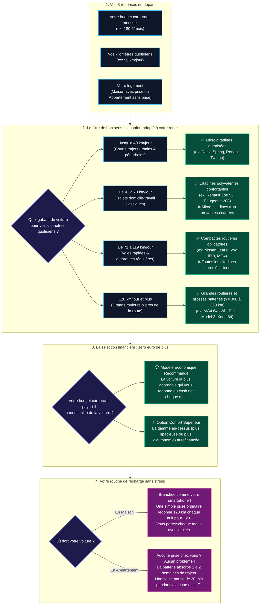

# Stop-Carburant.fr — Le carburant paye déjà votre prochaine voiture

> **🌐 Simulateur en ligne : [https://thomasgiroire.github.io/Stop-Carburant/](https://thomasgiroire.github.io/Stop-Carburant/)**  
> *Zéro bla-bla • Des chiffres réels • 100 % Open Source et vérifiable*

---

## 🎯 Le Pourquoi du projet

Pour des millions de ménages, de soignants itinérants, d'artisans et de navetteurs périurbains, **le carburant est une hémorragie financière silencieuse** : 150 €, 200 € ou 300 € disparaissent chaque mois simplement pour conserver le droit d'aller travailler.

Face à cela, le passage à la mobilité électrique est souvent perçu comme inaccessible en raison du prix d'achat facial affiché en concession.

**Stop-Carburant** est né d'un constat mathématique simple : **votre budget carburant actuel paie déjà la mensualité d'un véhicule électrique sans que vous le sachiez.**

### Les objectifs du simulateur :
1. **Électrochoc financier :** Rendre visible la perte sèche cumulée sur 5 ans (10 000 € à 20 000 € littéralement partis en fumée).
2. **Neutralisation de budget :** Montrer comment réallouer ce flux financier contraint en mensualité d'acquisition pour un véhicule qui vous appartient.
3. **Zéro friction, zéro bla-bla :** Pas de formulaire intrusif de 20 questions, pas de collecte d'e-mails pour revendre des leads à des courtiers. Une réponse claire et personnalisée en 3 clics.
4. **Réponses concrètes aux contraintes du quotidien :** Prise en compte immédiate de votre logement (maison avec recharge de nuit à 2 € les 100 km, ou appartement sans prise avec recharge lors des courses ou sur borne publique).

---

## 🔬 Méthodologie et Transparence (Vérifiable car Open Source)

L'indépendance et la rigueur scientifique sont les piliers de ce projet. Aucun constructeur, fournisseur d'énergie ou organisme de crédit ne sponsorise ce simulateur. Tous les calculs sont **exécutés localement dans votre navigateur** et **l'intégralité du code et des formules est consultable et auditable publiquement**.

### Comment l'algorithme choisit votre voiture (sans jargon technique)

Le simulateur ne cherche pas à vous vendre un modèle en particulier : il applique des règles de bon sens physique et financier pour trouver la voiture qui simplifie votre vie sans toucher à vos économies.



---

### 1. Des données officielles en Open Data et en direct

- **Prix des carburants en temps réel :**  
  Alimenté par les flux Open Data du Ministère de l'Économie et des Finances (`prix-carburants.gouv.fr` via data.gouv.fr), mis à jour quotidiennement station par station et ventilé par département.
- **Mix des carburants du parc automobile :**  
  Conformément aux statistiques officielles du parc roulant français, la conversion thermique applique la pondération réelle des motorisations (Diesel 54 %, Essence 43 %, Superéthanol E85 3 %) ou le carburant spécifique sélectionné par l'utilisateur.
- **Tarifs de l'électricité certifiés :**  
  - *À domicile (Maison) :* Tarif réglementé de vente EDF (Tarif Bleu) en Heures Creuses (0,2068 €/kWh) et Base (0,2516 €/kWh).
  - *En itinérance / Appartement :* Barème moyen constaté sur bornes publiques semi-rapides (0,45 €/kWh).
- **Catalogue de véhicules d'occasion et neufs vérifiés :**  
  Base consolidée à partir des données d'homologation WLTP et des consommations réelles constatées par les conducteurs, enrichie par les offres du marché de l'occasion vérifiées en France (Dacia Spring, Renault Zoé, Peugeot e-208, MG4, Tesla Model 3, etc.).

---

### 2. Modèle de calcul financier

#### A. Kilométrage Mensuel Déduit ($K_{mensuel}$)
Si l'utilisateur renseigne son budget mensuel ($B_{mensuel}$ en €), le kilométrage est déduit du prix pondéré du carburant ($P_{carb}$ en €/L) et de la consommation moyenne thermique ($C_{therm} = 6,5$ L/100 km) :
$$K_{mensuel} = \frac{B_{mensuel}}{P_{carb}} \times \frac{100}{C_{therm}}$$

#### B. Coût de l'énergie électrique ($E_{elec}$)
Pour une consommation électrique moyenne de $15 \text{ à } 17\text{ kWh/100 km}$ selon le gabarit :
$$E_{elec} = \frac{K_{mensuel}}{100} \times C_{elec} \times P_{kWh}$$

#### C. Gain d'entretien mécanique ($G_{ent}$)
Un moteur électrique comporte environ 1 % des pièces en mouvement d'un moteur thermique (absence de vidange, courroie de distribution, bougies, embrayage, boîte de vitesses complexe, usure divisée par 2 des freins grâce au freinage régénératif).  
Le gain conservateur retenu est de **30 € / mois** (chiffre issu des analyses de coût total de possession de l'ADEME).

#### D. Cash Mensuel Libéré ($B_{libere}$)
$$B_{libere} = (B_{mensuel} - E_{elec}) + G_{ent}$$
Ce montant représente la capacité de financement mensuelle disponible à iso-dépense.

#### E. Barèmes de financement appliqués
- **Prêt Éco-Mobilité bonifié :** 1,00 % TAEG fixe (dispositifs bancaires et mutualistes pour la transition écologique sur véhicules jusqu'à 10 000 €).
- **Crédit automobile classique :** 4,90 % TAEG fixe (durée standard de 60 mois).

---

### 3. Neutralité et sources institutionnelles contre les idées reçues

La section "Preuves & FAQ Anti-Biais" s'appuie exclusivement sur des études vérifiées et des sources institutionnelles neutres :
- **Santé des batteries :** Analyse empirique sur 10 000 véhicules en circulation montrant une dégradation moyenne de seulement 1,8 % par an ([Geotab](https://www.geotab.com)).
- **Sécurité incendie :** Risque 20 fois inférieur pour un VE comparé aux vapeurs d'hydrocarbures des véhicules thermiques ([MSB - Agence suédoise de protection civile](https://www.msb.se)).
- **Dette carbone de fabrication :** Rentabilisée dès 30 000 km grâce au mix électrique français décarboné ([Rapports ADEME](https://www.ademe.fr)).
- **Impact sur le réseau électrique :** Capacité du réseau largement dimensionnée pour la recharge nocturne (15 millions de VE représenteraient moins de 10 % de la production) ([Bilan Prévisionnel RTE](https://www.rte-france.com)).
- **Fiabilité mécanique & pannes :** Moteur électrique 10× plus simple (1 seule pièce mobile contre 2 000 dans un moteur thermique) et baromètres réels démontrant un taux de panne immobilisante nettement inférieur ([ADAC Pannenstatistik](https://www.adac.de)).

---

## 👥 Cas d'usage concrets & Résultats simulés (issus des tests E2E)

Pour garantir la justesse des calculs en situation réelle, le simulateur est éprouvé par une batterie de **tests E2E reproduisant les profils d'automobilistes français** (navetteurs périurbains, professionnels itinérants, soignants, résidents en appartement sans prise, grands rouleurs) :

| Persona & Profil | Paramètres réels | Véhicule recommandé | Stratégie de recharge | Résultat & Impact financier |
| :--- | :--- | :--- | :--- | :--- |
| **Julien**<br>Navetteur périurbain | **70 km/j**<br>150 €/mois essence<br>Maison | **Renault Zoé R90** *(Option confort : Nissan Leaf II)* | Prise domestique la nuit (~2 € pour 70 km) | **Gain net direct en poche** dès le premier mois.<br>Entretien : **+25 €/mois** économisés. |
| **Sandrine**<br>Ouvrière rurale en 3x8 | **90 km/j**<br>185 €/mois gazole<br>Maison | **Nissan Leaf II** (Compacte routière) | Heures Creuses EDF en horaires décalés | **Autofinancement quasi-intégral** (~8 €/m en HC).<br>Entretien : **+30 €/mois** économisés. |
| **Nathalie**<br>Infirmière libérale (IDEL) | **130 km/j**<br>250 €/mois gazole<br>Maison | **MG4 Luxury (64 kWh)** (365 km réels) | Recharge de nuit complète couvrant toute la tournée | Remplacement sécurisé d'un outil de travail pro.<br>Entretien : **+45 €/mois** d'économies. |
| **Marc**<br>Artisan électricien | **110 km/j**<br>240 €/mois gazole<br>Maison | **Nissan Leaf II** *(Option : Peugeot e-2008)* | Prise à domicile la nuit | Baisse directe des charges d'exploitation.<br>Entretien : **+40 €/mois** économisés. |
| **Karim**<br>Chauffeur VSL / Taxi | **180 km/j** (~4 320 km/mois)<br>360 €/mois gazole<br>Maison | **Volkswagen ID.3 / MG4 / Tesla Model 3** *(Citadines Zoé/Spring exclues)* | Prise domicile + appoint réseau | Confort routier adapté au gros roulage.<br>Entretien : **+65 €/mois** économisés. |
| **Élodie**<br>Navetteuse en appartement | **50 km/j**<br>110 €/mois essence<br>Appartement (sans prise) | **Renault Zoé R90** (240 km d'autonomie) | Bornes publiques / supermarché (1 recharge de 20 min tous les 4 jours) | Rentable même au tarif borne (0,45 €/kWh).<br>Fini les arrêts en station-service. |
| **Gérard**<br>Grand rouleur interurbain | **160 km/j** (~3 840 km/mois)<br>290 €/mois gazole<br>Maison | **Volkswagen ID.3 / MG4 / Hyundai Kona** *(Filtre confort routier)* | Prise à domicile nocturne | Remplacement d'une routière diesel amortie par le carburant.<br>Entretien : **+60 €/mois** économisés. |
| **Grand Rouleur 200 km/j**<br>Cadre / Navetteur longue distance | **200 km/j** (~4 800 km/mois)<br>450 €/mois gazole<br>Maison | **Tesla Model 3 / Grande routière** | Prise domestique nocturne | **200 € à 300 € / mois de cash net libéré** en roulant en berline haut de gamme.<br>Entretien : **+70 €/mois** économisés. |

> [!TIP]
> **Règle de confort et de sécurité intégrée au simulateur :**  
> - Jusqu'à **40 km/jour** : Les micro-citadines économiques (Dacia Spring, Twingo) sont acceptées.  
> - De **41 à 70 km/jour** : Les citadines polyvalentes (Renault Zoé, Peugeot e-208) apportent l'insonorisation nécessaire.  
> - Au-delà de **70 km/jour** : L'algorithme écarte formellement toutes les citadines pour orienter exclusivement vers des compactes et berlines (Nissan Leaf II, VW ID.3, MG4, Tesla Model 3) afin de préserver votre dos et votre sécurité sur les voies rapides.  
> - Dès **120 km/jour** : Exigence d'au moins **300 km réels**, portée à **350 km réels** dès 160 km/jour.

---

## 💻 Documentation Technique & Développement

Pour exécuter le projet en local, lancer les tests ou inspecter l'environnement Docker :

👉 **Consultez le [Guide de Développement pour les Développeurs](docs/DEVELOPMENT.md)**  
👉 **Consultez le [Cahier des Charges initial](docs/cahier_des_charges_simulateur_la_faille_carburant.md)**

```bash
# Lancement rapide en local
npm install
npm run dev

# Exécution de la suite de tests (154 tests unitaires et E2E)
npm test
```

---

## ⚖️ Licence

Ce projet est distribué sous licence open-source MIT. Vous êtes libre de l'utiliser, de l'étudier, de le modifier et de le partager en toute transparence.